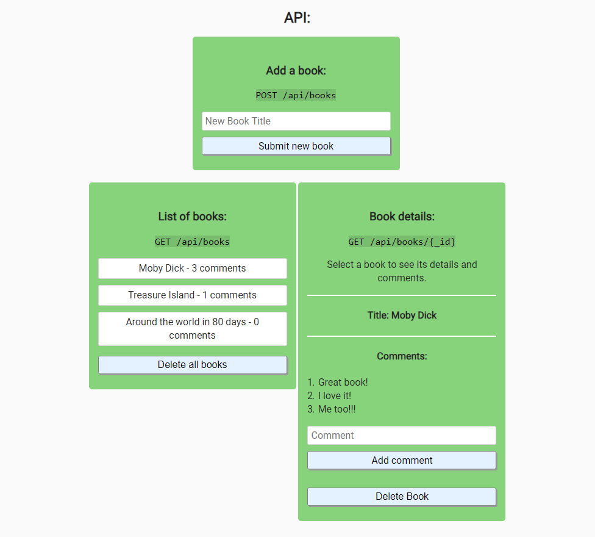

# Personal Library

## Introduction

Users can add or remove books to a public list. Individual books show users comments.  

Main focus lies on the implementation of the backend and its feature testing.  

This project is part of freeCodeCamps Information Security and Quality Assurance certificate.

***

## Behind the scenes
### Frontend
* HTML5
* CSS3
* JavaScript

### Backend
* Node
* Express
* Helmet
* Chai
* MongoDB

***

## Preview Images
### Project Requirements:
  

### Main Screen:

